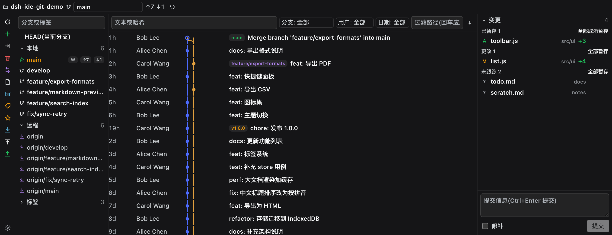
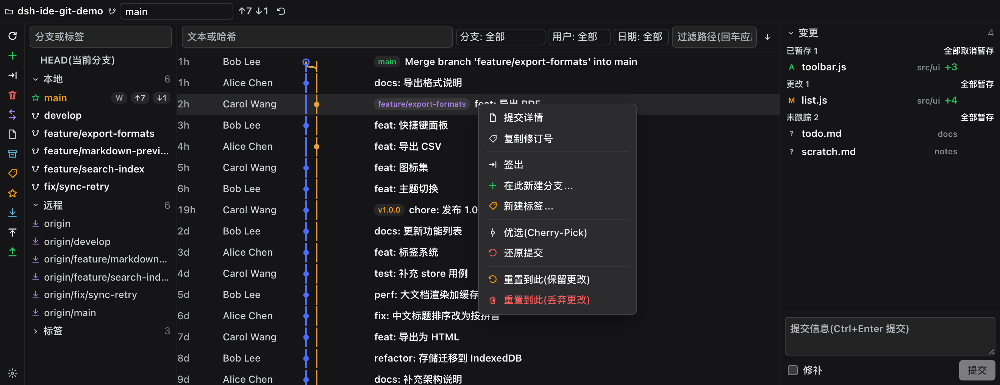
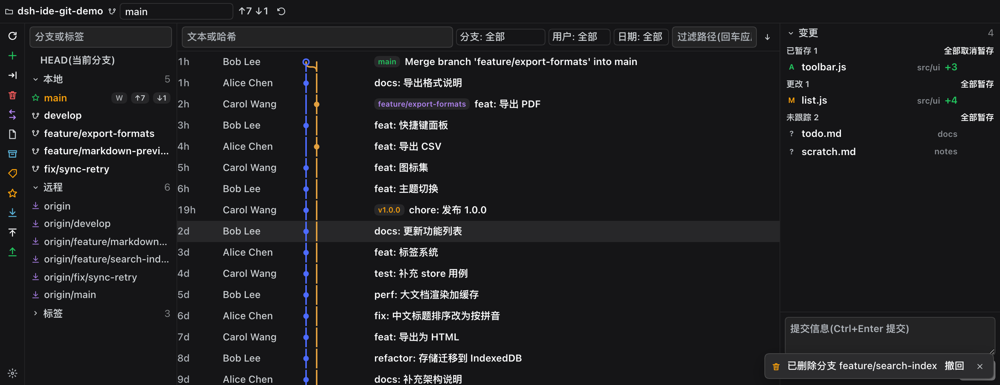
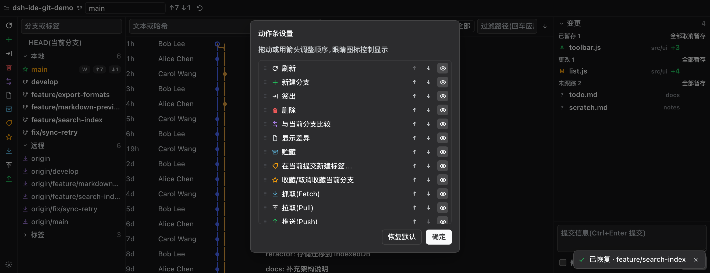
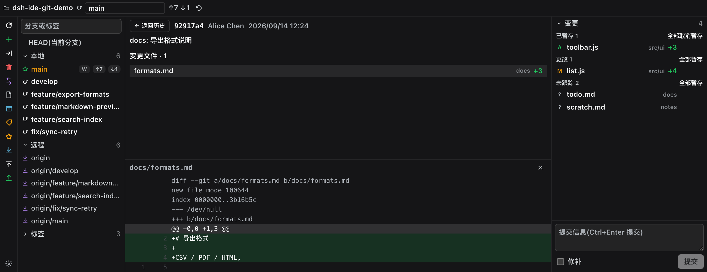
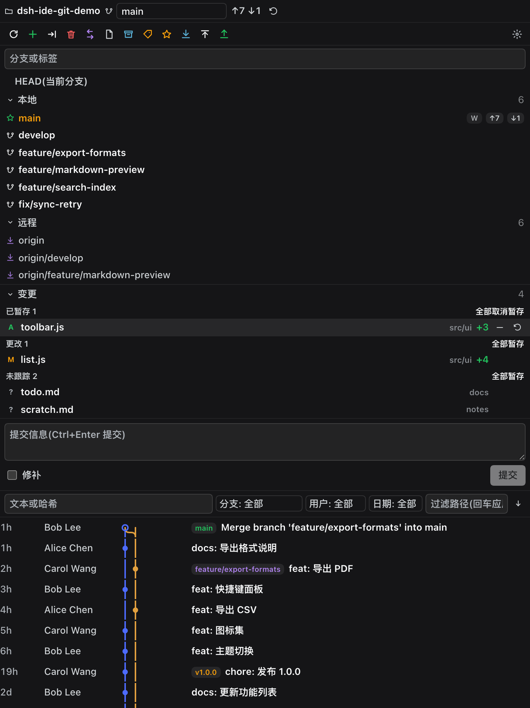

# dsh-ide-git

简体中文 | [English](README_EN.md)

> 给 [DeepSeek Harness (DSH)](https://github.com/deepseek-ai/deepseek-harness) 的侧边栏装一个 **IDE 级的 Git 工具窗口**——左边分支树、中间提交图谱、右边变更与提交详情,操作方式对齐 JetBrains 系 IDE 的 Git 面板;以 [dsh-better-sidebar](https://github.com/omdsh-dev/DSH-better-sidebar) 原生 Tab 的形式注册,右侧栏与底部面板都能用。

DSH 自带的 Git 面板覆盖「暂存 / 提交 / 还原 / 看历史」;`dsh-ide-git` 补齐 IDE 用户习惯的那一层:**分支树 + 右键分支操作 + 提交图谱 + 提交详情 + 变更列表 + 提交框**。

## 它解决什么

- **分支管理没有树**:内置面板只有一个分支下拉。这里给出 `HEAD(当前分支) / 本地 / 远程 / 标签` 的分组树,每个分支带 ahead/behind 角标、上游、worktree 占用标记(`W`)。
- **历史只是列表**:这里画出提交图谱(lane 拓扑 + 分支/标签 ref 徽章),支持加载更多与过滤(文本 / 哈希 / 作者)。
- **想看某个提交改了什么**:点提交直接进详情——作者、日期、完整提交信息、变更文件(含 +/− 行数),点文件看逐行 diff(红绿 + 行号 + hunk 高亮)。
- **想比较分支**:分支右键即可与当前分支比较,结果按文件与提交数汇报。
- **操作要够全**:签出、从任意分支/提交新建分支、重命名、删除、合并到当前、变基当前到此、新建标签、cherry-pick、还原提交、重置(保留/丢弃)、fetch / pull --ff-only / push(确认后)。

## 效果

> 下面这些图取自一个**只装了两个插件**(`dsh-better-sidebar` + 本插件)的干净 DSH,绑定在一个虚构的演示仓库上(见 `scripts/demo-repo.mjs`),画面里没有真实工作区、没有壁纸插件、也没有其它面板。

<table>
<tr>
<td align="center" width="58%"></td>
<td valign="top"><b>底部工作台(宽扁 → 三栏)</b><br/>左列是 IDEA 式动作条:按<b>自身高度</b>决定放几个按钮,放不下的收进 <code>⋯</code>,末尾 <code>⚙</code> 可调顺序与显隐;中列是提交列表——列序与 IDEA 一致(<b>日期 → 提交人 → 图谱 → 分支标签 → 提交信息</b>),上方一排筛选(文本/哈希、分支或标签、提交人、日期、路径)与排序方向;右列是变更分组与提交框。</td>
</tr>
</table>

<table>
<tr>
<td align="center" width="58%"></td>
<td valign="top"><b>提交右键</b><br/>详情、复制修订号、签出该修订、在此新建分支、新建标签、优选(Cherry-Pick)、还原提交、重置到此(保留/丢弃更改)——破坏性项标红,菜单在面板内定位,底部工作台里同样能弹出来。</td>
</tr>
<tr>
<td align="center" width="58%"></td>
<td valign="top"><b>删除可撤回</b><br/>删除分支/贮藏是<b>真删除</b>,但宿主在动手前记下了对象 id:右下角浮窗点「撤回」即可恢复(一次性、30 分钟内有效);错过浮窗还有顶栏的「最近可撤回的操作」入口。删除 <code>main</code>/<code>master</code> 需要输入分支名确认。</td>
</tr>
</table>

<table>
<tr>
<td align="center" width="58%"></td>
<td valign="top"><b>动作条可配置</b><br/>拖动或用箭头调整顺序、眼睛图标逐项显隐,配置只存「排列 + 隐藏」并做过归一化,以后新增动作不会打坏旧配置。</td>
</tr>
<tr>
<td align="center" width="58%"></td>
<td valign="top"><b>提交详情</b><br/>完整提交信息、作者与日期、变更文件列表(带 +/− 行数),点文件看逐行 diff(行号 + hunk 高亮 + 红绿底)。</td>
</tr>
</table>

<table>
<tr>
<td align="center" width="58%"></td>
<td valign="top"><b>同一个注册,两种布局</b><br/>窄而高的<b>原生右侧栏</b>改用堆叠布局:动作条铺成顶部一行、变更在先、提交列表随后——面板只量自己的尺寸,从不猜自己在哪个容器里。截图顺序、演示仓库与干净环境都由 <code>scripts/screenshots.mjs</code> 复现。</td>
</tr>
</table>

## 挂在哪里:两个宿主,一个面板

本插件只注册一次,落到哪个面上由**宿主**决定,两条通道互斥:

| 宿主 | 条件 | 你得到什么 |
|---|---|---|
| **dsh-better-sidebar**(底座,可选) | 装了它 | 它的 Tab 系统:右侧栏里的原生 Tab **加上底部工作台**;它的设置页 `侧边卡片` 里能看到本插件的卡片 |
| **DSH 原生右侧栏** | 没装底座时自动接管 | 右侧栏 Guide 页里的 **Git** 胶囊 → 点开就是同一个面板 |

底座在场时以它为准(它还带底部工作台);底座**晚到**会顶掉原生注册再挂到它那边。所以**只装本插件也能用**,没有任何前置要求。

同一个面板会出现在形态完全不同的面上,所以布局靠量而不是猜:

| 面 | 形态 | 本插件的布局 |
|---|---|---|
| 右侧栏(原生的,或底座桥接过来的) | 窄而高 | `stack`:变更区在提交历史之上,分支树可收起,详情/差异占满主区 |
| 底部工作台(底座自有) | 宽而扁 | `columns`:分支树 · 提交图谱 · 变更与提交框,三栏并排——就是 JetBrains Git 工具窗口的样子 |

插件不猜自己在哪儿,而是用 `ResizeObserver` 量自己的容器:宽 ≥ 600px 且宽 ≥ 高 × 1.15 走三栏,否则走纵向堆叠(宽度说了算,高度没有否决权)。自由浮窗、移动端抽屉同样自适应。

## 功能一览

| 区域 | 能力 |
|---|---|
| 动作条 | IDEA 式左侧竖排(底部工作台)/ 顶栏下一行横排(右侧栏):刷新、新建分支、签出、删除、比较、显示差异、贮藏、新建标签、收藏、抓取、拉取、推送。**按可用空间自动决定放几个**,放不下的收进 `⋯ 更多`;末尾 `⚙ 设置` 可拖动排序、逐项显隐(存 `dsh-ide-git.rail.v1`)。每个按钮按当前状态点亮/置灰(没有其他分支就不能删除/签出/比较,没有远程就不能抓取/推送,没有上游就不能拉取,没有变更就没有差异可看) |
| 状态行 | 当前分支、上游、`↑ahead ↓behind`、stash 数量、忙碌指示 |
| 分支树 | `HEAD / 本地 / 远程 / 标签` 分组(可折叠)、过滤框、星标当前分支、ahead/behind 角标、worktree 占用标记;本地蓝 / 远程紫 / 标签黄 / HEAD 绿 |
| 分支右键 | 签出、将当前分支变基到此、合并到当前分支、与当前分支比较、从该分支新建分支、重命名、删除(当前分支禁用)、更新(Fetch)、推送 |
| 历史筛选 | 文本或哈希、分支或标签、提交人、日期(今天 / 近 7 天 / 近 30 天 / 今年),外加排序方向(新→旧 / 旧→新)与一键清除;路径筛选回车后由 git 服务端过滤(`git log -- <path>`) |
| 提交列表 | 列序对齐 IDEA:**日期 → 提交人 → 图谱 → 分支标签 → 提交信息**;lane 拓扑图整格连线(相邻行像素对齐)、HEAD 空心点、refs 徽章(HEAD 绿 / 本地蓝 / 远程紫 / 标签黄,最多 3 个 + `+n`)、加载更多(每页 120) |
| 提交右键 | 提交详情、复制修订号、签出该修订(确认)、在此新建分支、新建标签、cherry-pick、还原提交、重置到此(保留 / 丢弃更改) |
| 提交详情 | 完整提交信息、作者/日期、变更文件列表(+/−),点文件看逐行 diff |
| 变更列表 | 冲突 / 已暂存 / 更改 / 未跟踪 四组,行内 暂存 / 取消暂存 / 丢弃,分组级「全部暂存 / 全部取消暂存」,点击行看 diff |
| 提交框 | 多行提交信息、`Ctrl+Enter`(macOS `Cmd+Enter`)提交、修补上次提交(`--amend`) |
| 文件右键 | 显示差异、暂存/取消暂存、丢弃更改、复制路径 |
| 安全与撤回 | 删除分支 / 删除贮藏后右下角弹提示条,点「撤回」即可恢复(真删除 + 按删除前记下的对象 id 重建,一次性、30 分钟内有效),顶栏的撤回图标里也能找到最近删除;`main`/`master`/`trunk` 的删除要求输入分支名确认,所有破坏性确认框焦点默认在「取消」;同一仓库的写操作在宿主串行执行;仓库里还有未结束的 merge / rebase / cherry-pick / revert / bisect 时,相关动作全部置灰并说明原因 |

## 安装

```sh
# 本插件可以单独使用:面板直接出现在 DSH 原生右侧栏
dsh plugin --profile web add dsh-ide-git
# 可选底座:装了它才会多出底部工作台,并跟随它的侧栏布局
dsh plugin --profile web add dsh-better-sidebar
# 重启 dsh web
```

装好后打开任意会话:

- **只装本插件**:点会话头右侧的「打开右侧边栏」→ Guide 页里的 **Git** 胶囊 → 面板打开;
- **装了底座**:会话头右侧的面板开合按钮 → 面板 Tab 条右侧 `+` → 选 **Git**(底部工作台);原生右侧栏的 `+` → **Git**(同一注册,同一份状态);
- 底座在场时,它的设置页 **侧边卡片** 分区里也会出现本插件的卡片(标题 / id / 启用开关),随时停用。

### 兼容性

- `engines.dsh` 声明为 **`>=0.1.2-0`** ——0.1.2 起的全部版本都算,包括 `0.1.5-rc` / `0.1.6-alpha` 这类**预发布**(纯 semver 下预发布默认不匹配任何范围,所以起点写成了 `-0`)。
- 只依赖三样长期契约:宿主半的 `webServer.register({ kind: 'prefix' })` 路由、客户端半的 `window.__ModuleLoader__.load({ id, factory })`、以及客户端的 `slots` 服务。**不引用 `ui-primitives` 图标集**(图标全是自带 SVG),所以宿主删改图标不会波及本插件。
- 底座是**可选** peer:没装、装坏了、或它自己要等上游修,都不影响本插件挂到原生右侧栏。

## 工作原理

```
宿主半 src/index.js                       客户端半 src/client.js
  POST /dsh-ide-git/api/<method>            ctx.betterSidebar.registerTab({ id: 'dsh-ide-git:panel' })
  └─ spawn('git', argv, { cwd })            └─ Panel:ResizeObserver → columns / stack
     └─ 会话工作区 = cwd(客户端 scope.cwd 传入)
```

- **宿主半**:一个前缀路由 `/dsh-ide-git/api`,方法表 32 个(`summary` / `branches` / `log` / `commitDetail` / `diff` / `compare` / `stage` / … / `push` / `tagDelete` / `version`)。所有 git 调用都是 **argv 数组 + `spawn`**(没有 shell 字符串、没有 `exec`),参数先过校验(绝对路径、ref 不以 `-` 开头、无控制字符、路径不越出仓库)。
- **客户端半**:无构建、单文件、`window.__ModuleLoader__.load({ id, factory })` 包装,只 `require('react')`(DSH 客户端基线模块白名单内)。
- **信任围栏**:路由挂在 DSH 自己的 web server 上,天然同源;只有 Host 为 loopback,或浏览器标记 `Sec-Fetch-Site: same-origin/same-site` 的请求才会被服务。
- **破坏性操作**:`push` / 硬重置 / 强制删分支 / 丢弃未跟踪文件 / 删除 stash 都必须显式 `confirm: true`,UI 侧一律弹二次确认。

## 限制与路线图

- **v0.1.0 只覆盖主路径**:分支树 + 图谱 + 变更 + 提交 + 详情 + 常用分支/提交操作。下面的还在路上:
  - 变更/提交的**多选与批量操作**、按文件部分提交(类似 IDEA 的 Changelist);
  - 交互式变基(`rebase -i`)、fixup/squash、补丁(format-patch/apply);
  - 三方合并冲突编辑器、冲突解决动作(接受本地/远端);
  - blame / 文件历史视图、行级注释;
  - 设置页的插件自有开关(提交后自动刷新、diff 上下文行数等);
  - worktree 视图(当前只在分支行标注占用)。
- **只面向 `web` profile**:`dsh.client.platform` 为 `web`;桌面客户端的 renderer 复用同一套 shell 资产,但尚未真机验证。
- **不写 `.git`**:所有操作都通过 `git` 命令走正常索引/引用,插件不直接改 `.git` 内部文件。
- **大仓库**:提交列表分页(120/页),diff 输出上限 400KB(超出截断并标记)。

## 开发

```sh
npm test      # 两层:smoke(文件级:清单一致性、客户端包装、白名单、确认守卫、方法表)
              #      + api(临时真实仓库直驱宿主路由:解析、暂存/提交/分支/标签/stash、全部守卫与信任围栏)
```

本机联调:把仓库加到 web profile 后重启 `dsh web`;客户端半改动由 DSH 热加载,宿主半改动需要重启。

## 许可

MIT © KannaKuron
